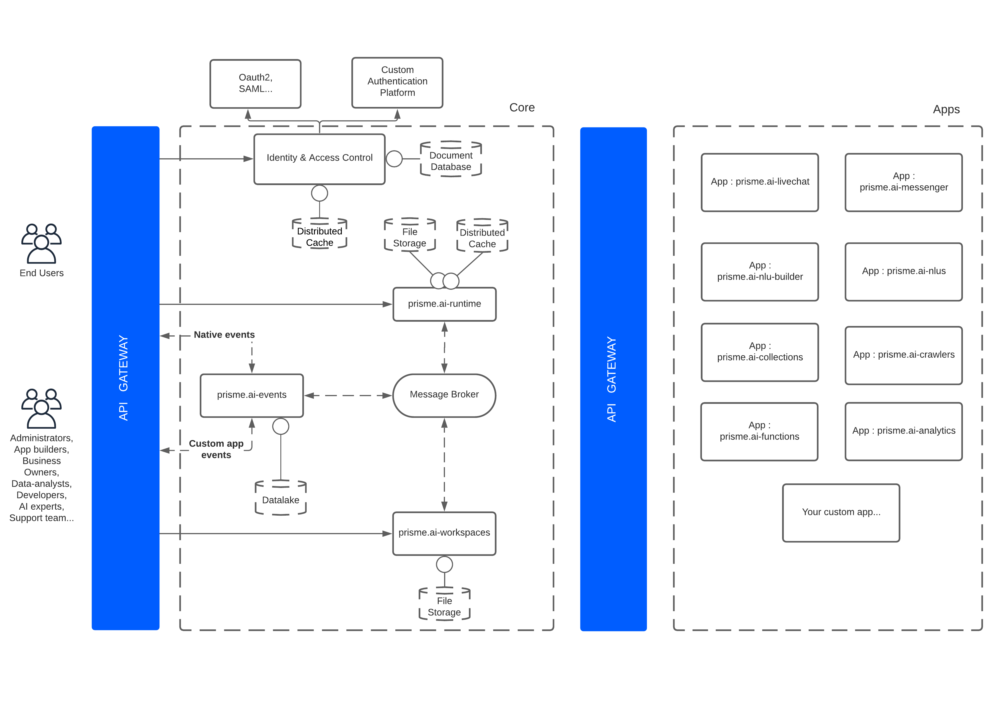

# Microservices

## Architecture

## API Gateway
This is the only public endpoint of the architecture.  
The API Gateway enforces authentication, authorization, rate limits and others policies on incoming requests before dispatching them to the right microservice.

## prisme.ai-events
**prisme.ai-events** is the interface between the message broker and external consumers / producers.  
More specifically, **prisme.ai-events** is in charge of :  
- Enabling the consumption of events from an external service in websocket or HTTP long polling
- Allowing the emission of events from an external service in websocket or HTTP long polling
- Historization (storage in a data lake) of each event handled by the message broker
- Searching for events through various filters directly from the data lake

## prisme.ai-runtime
**prisme.ai-runtime** service is in charge of the workspaces execution depending on declared triggers, such as : events, dates or HTTP.

## prisme.ai-workspaces
**prisme.ai-workspaces** service is in charge of workspace edition : CRUD operations on a workspace, CRUD on one of its automation or installation/configuration of an app.

## Message Broker  
The message broker allows every internal microservice to communicate with each other, as well as providing **automations** & **apps** with their messaging capability through **triggers**, and **emit / wait** instructions.
It might by any well-known broker such as Kafka, RabbitMQ, Redis ...  

Internal microservices uses the @prisme.ai/broker npm package in order to stay "broker
technology" agnostic and ease broker replacement.  

However, **Redis 5.0** is the only supported broker currently.
